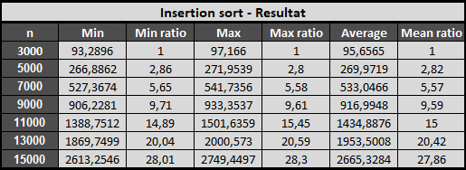
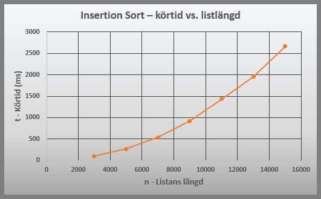
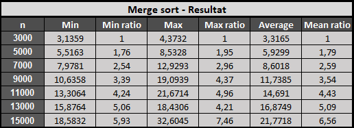
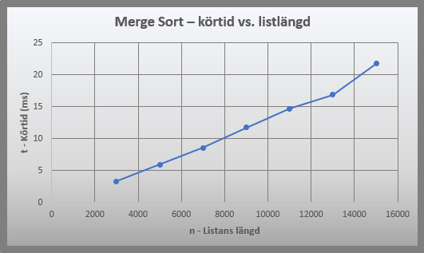

# Veckouppgift 3 - Prestandatest

## 📊 Status

Här nedan presenteras en översikt över statusen på lösande av uppgfterna.

| Uppgift                          | Status |
|:---------------------------------|:------:|
| 0. Projektstruktur               |   🟢   |
| 1. Diskussionsfrågor             |   🟢   |
| 2. Prestandatest: Insertion sort |   🟢   |
| 3. Prestandatest: merge sort     |   🟢   |


## 0️⃣Projektstruktur
Skapa ett projekt enligt alla konstens regler, på det sätt vi gått igenom på lektionen.


## 1️⃣Diskussion

### Uppgift: 
Svara på frågorna:
1. Vad är en regression? När inträffar de oftast under ett projekts livstid?  
En regression är när något som tidigare fungerat slutat fungera efter en ändring. 
De inträffar oftast då någon förändring av koden sker. Det kan vara vid:
- Implementering av ny kod
- Refaktorering - Förändring av befintlig kod ändrar beteendet
- Bugfixning - lösning av ett problem skapar ett annat
- Ändringar av kodens beroenden
- Förändring av gränssnitt mor databeser och api'er

2. Vad är skillnaden mellan enhetstest och regressionstest?  
Enhetstest är det initiala testet av delsystem, t.ex. en funktion. Syftet är att kontrollera  
att en specifik del fungerar korrekt. Regressionstest syftar till att verifiera att tidgiare
implementerad kod fungerar efter ändringar. Det innebär att ett test som från början var ett
enhetstest kan bli ett regressionstest senare i projektet.   


3. Vilka krav på git-kunskap kräver det av utvecklare att jobba med CI?  
GIT är en central del i CI konceptet. Då en ändring gjorts i ett repository startar ofta
en pipeline automatiskt. Den kan då t.ex. köra tester och bygga kod. Den som arbetar med 
CI bör minst vara bekant med kommandona Clone, Pull, Add, Commit, Push. Det är också viktigt
att förstå begreppen branch och merge samt kunna hantera pull och merge requests.


4. Vad är en feature? Hur förhåller det sig till kraven?   
En feature är oftast en funktion eller funktionalitet i ett system. Det är en del av 
systemet som kan göra något för användaren av detsamma. Det kan t.ex. vara en inloggnings-
funktion, gör en betalning eller lägga till en vara i en kundkorg.  
En feature motsvarar ofta ett funktionellt krav och motsvarar en del av vad systemet ska 
kunna göra. Featuren utvecklas för att uppfylla ett funktionellt krav. T.ex. kan ett krav 
vara att användaren ska kunna radera ett testfält och detta leder till en funktionalitet som 
uppfyller kravet - "text_filed-reset".


5. Vilka fördelar får en kund av att utvecklarna jobbar med CD?  
Att arbete md CD medför ofta snabbare leveranstider, felrättning och feedback av nya leveranser. 
Automatiska tester körs regelbundet, vilket ökar kvalitén och miskar risken för regression. Man 
slipper stora komplexa och oförutsägbara leveranser. Med mindre och snabbare leveranser kan kunden 
snabbt få tillgång till ny funktionalitet och projektet får fortlöpande feedback på levererad funktionalitet.


6. Vilka fördelar får utvecklare av att jobba med CD?  
Fördelarna för utvkecklarna övernstämmer mycket med de för kunden. Automatiserade processer 
minskar behovet av manuellt arbete. Då varje förändring är mindre blir det lättare att hitta 
eventuella fel och buggar. Utvecklaren får snabbt feedback om den nya koden är tillfyllest eller
om den orsakar fel.


7. Varför kan man inte veta exakt hur lång tid det kommer ta att köra kod?   
Det är många faktorer som påverkan hur lång tid det tar att köra kod. Datorn som koden körs
på kan ha olika prestanda på OS, CPU, GPU och minnen. Lagringsmedia och nätverk kan variera då koden
läser data och filer. Datorns cache kan innehålla data vid ett körtillfälle och inte vid ett annat.


8. Varför skriver man till exempel O(n) men inte O(2*n + 10)?  
Big O tar inte hänsyn till några exakta detaljer, utan används för att beskriva hur tiden 
ökar när n blir större. Värdet + 10 blir ointressant redan vid mindre ökningar av n. Om n = 
10 blir 2n + 10 = 30. Om man ökar n till 100 blir 2n + 10 = 210. 2n har en mycket större inverkan 
på tidsåtgången än de + 10. Konstanten (2) för 2n spelar ingen roll för tillväxttakten. Om n = 10 
är 2n = 20. Ökas n till 20 blir 2n 40. Ökningen är alltså proportionellt lika och man kan bortse
från konstanten då tillväxttakten är densamma. 


## 2️⃣ Prestandatest: Insertion sort

````python
def insertion_sort(lst):
    result = []
    for item in lst:
        inserted = False
        index = 0
        while not inserted and index < len(result):
            if item < result[index]:
                result.insert(index, item)
                inserted = True
            index += 1
        if not inserted:
            result.append(item)
    return result
````  
  
1. Vad har funktionen för tidskomplexitet?  
Yttre loop:  
0+1+2+⋯+(n−1) = n(n - 1) / 2  
n(n − 1) / 2 - n2 − n / 2  
n² är den dominerande termen då den växer snabbare än n  

Om listan är sorterad blir best case = O(n2)
Om listan är osorterad blir worst case = O(n2)  

2. Skriv enhetstest som kontrollerar att funktionen kan sortera en lista med tal korrekt.  
````python
pytest -v -m "unit and insertion_sort"
````
### Tester:  
test_insertion_sort_unsorted_list()  
test_insertion_sort_sorted_list()  
test_insertion_sort_single_element_list()  
test_insertion_sort_empty_element_list()

3. Skriv prestandatest som testar att sortera en riktigt lång, slumpad lista.
````python
pytest --benchmark-columns="min,max,mean" -m "performance and insertion_sort"
````
### Tester:  
- test_insertion_sort_unsorted_random_list_3000_items  
- test_insertion_sort_unsorted_random_list_5000_items  
- test_insertion_sort_unsorted_random_list_7000_items  
- test_insertion_sort_unsorted_random_list_9000_items  
- test_insertion_sort_unsorted_random_list_11000_items  
- test_insertion_sort_unsorted_random_list_13000_items  
- test_insertion_sort_unsorted_random_list_15000_items  

### Resultat

Körtiden ökar ungefär kvadratiskt med listans längd (ratio). Detta stämmer med insertion sorts 
förväntade tidskomplexitet på O(n2). När listans längd ökar blir körtiden därför snabbt mycket längre.

)




## 3️⃣  Prestandatest: merge sort

````python
def merge_sort(lst):
    if len(lst) <= 1:
        return lst

    mid = len(lst) // 2
    left = merge_sort(lst[:mid])
    right = merge_sort(lst[mid:])

    return merge(left, right)

def merge(left, right):
    result = []
    i = j = 0

    while i < len(left) and j < len(right):
        if left[i] <= right[j]:
            result.append(left[i])
            i += 1
        else:
            result.append(right[j])
            j += 1

    result.extend(left[i:])
    result.extend(right[j:])
    return result

````  
1. Vad har funktionerna för tidskomplexitet?  

merge_sort()  
Beroende på antalet element måste originallistan delas med 2 ```log₂(n)``` gånger. Efter varje delning 
måste n element behandlas till en tidskostnad på O(n). Det ger ```n × log₂(n)``` = ```O(n log n)```.

merge()  
Varje element i listorna left och right behandlas en gång. Tidskomplexitetet blir därför 
linjär O(n). Även extend raderna som går igenom återstående element gör det linjärt, en 
operation per element. Det förändrar därför inte tidskomplexiteten.  

2. Skriv enhetstest som kontrollerar att funktionen kan sortera en lista med tal.
````python
pytest -v -m "unit and merge_sort"
````
### Tester:  
test_merge_sort_unsorted_list()  
test_merge_sort_sorted_list()  
test_merge_sort_single_element_list()  
test_merge_sort_empty_element_list()

4. Skriv prestandatest på samma sätt som i föregående uppgift.
````python
pytest --benchmark-columns="min,max,mean" -m performance
````
### Tester:  
- test_merge_sort_unsorted_random_list_3000_items  
- test_merge_sort_unsorted_random_list_5000_items  
- test_merge_sort_unsorted_random_list_7000_items  
- test_merge_sort_unsorted_random_list_9000_items  
- test_merge_sort_unsorted_random_list_11000_items  
- test_merge_sort_unsorted_random_list_13000_items  
- test_merge_sort_unsorted_random_list_15000_items  

### Resultat

Körtiden ökar ungefär enligt O(n log n) när listans längd ökar, vilket stämmer 
med merge sorts förväntade tidskomplexitet. Ratio-värdena visar att körtiden ökar, 
men betydligt långsammare än vid en kvadratisk tidskomplexitet (insertion).

)

